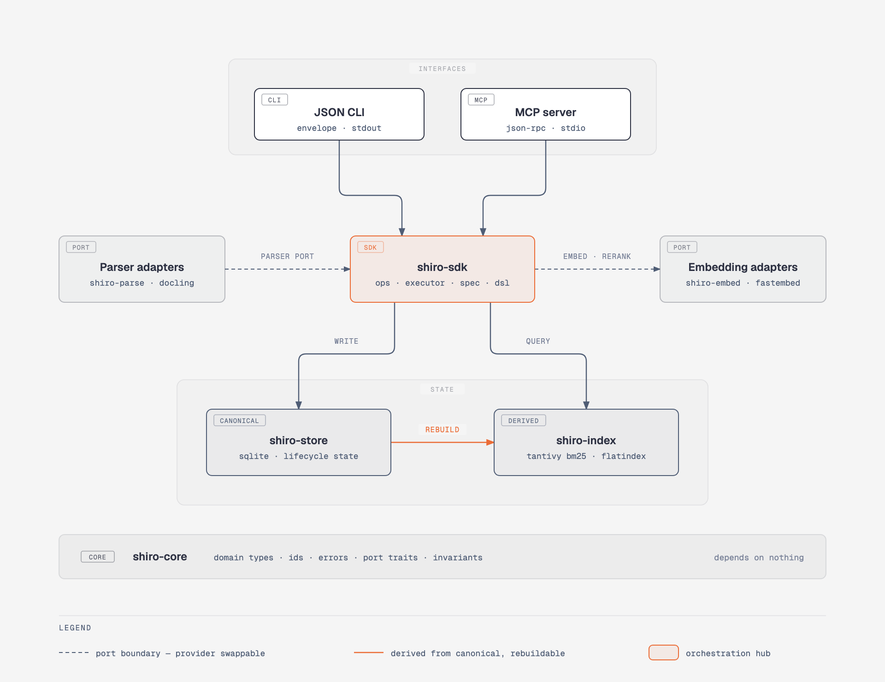

<h1 align="center">shiro</h1>

<p align="center">
  <strong>A local-first knowledge engine that turns PDFs and Markdown into structured, explainable search.</strong>
</p>

<p align="center">
  <a href="https://github.com/sanurb/shiro/actions"></a>
  <a href="https://github.com/sanurb/shiro/releases"></a>
  
  
</p>

---

**shiro** (Japanese for *castle*) indexes your documents into a searchable base that runs entirely on your machine. It parses PDFs and Markdown into a block-level intermediate representation that preserves reading order and heading hierarchy, then retrieves against it with BM25, local vector embeddings, and optional cross-encoder reranking.

Every command prints a single JSON object to stdout. There is no human-readable mode, no colors, and no interactive prompts — which makes shiro a component you can pipe into `jq`, drop into a shell script, or hand to an AI agent over MCP.

```bash
shiro ingest ~/Documents/papers
shiro search "distributed consensus" --rerank | jq '.result.hits[0]'
```

## Why shiro

- **Nothing leaves your machine.** Parsing, indexing, embedding, reranking, and search all run locally. The default embedding provider is FastEmbed (ONNX), so semantic search needs no API key and no network.
- **Results point at blocks, not files.** A hit identifies the exact block within a document — its kind, byte span, and a content-derived `blk_` evidence handle that survives re-parsing — so you can build a precise context window instead of stuffing a whole PDF into a prompt.
- **Every ranking is auditable.** `shiro explain` returns the pipeline, the ordered stages, the fusion parameters, and each source's individual contribution to a result's position.
- **Built for programs, not people.** Deterministic JSON, stable `E_*` error codes, meaningful exit codes, and a `next_actions` field on every response that tells a caller what it can legally do next.
- **Providers are swappable.** Embedding and reranking sit behind traits. FastEmbed is the local default; the HTTP adapter speaks to Ollama, llama.cpp, vLLM, or any OpenAI-compatible endpoint.
- **One binary.** No daemon, no server, no container. SQLite holds the state.

## Install

### Shell script (prebuilt binaries)

```bash
curl -sSfL https://raw.githubusercontent.com/sanurb/shiro/master/install.sh | sh
```

Detects your OS and architecture, downloads the latest release, and installs `shiro` into `~/.local/bin`. Override the destination with `SHIRO_INSTALL_DIR`.

### npm

```bash
npm install -g @sanurb/shiro-cli
```

The package ships no binary; a `postinstall` script fetches the right one from GitHub Releases. Linux and macOS only.

### Cargo

```bash
cargo install shiro-cli
```

Requires Rust 1.75 or newer. The crate is `shiro-cli`, the npm package is `@sanurb/shiro-cli`, and the executable is `shiro`.

## Quick start

```bash
shiro init                              # create ~/.shiro (override with --home)
shiro ingest ~/Documents/papers         # parse, index, and activate a directory
shiro search "distributed consensus"    # hybrid search by default
```

A search response:

```json
{
  "ok": true,
  "command": "search",
  "result": {
    "query": "distributed consensus",
    "mode": "hybrid",
    "retrieval_info": { "bm25_active": true, "vector_active": true, "reranker_active": false },
    "hits": [
      {
        "result_id": "res_a1b2c3d4e5f67890",
        "evidence_handle": "blk_a1b2c3...",
        "doc_id": "doc_9f8e7d...",
        "block_idx": 4,
        "block_kind": "PARAGRAPH",
        "span_start": 1024,
        "span_end": 1280,
        "snippet": "Raft achieves consensus by electing a leader...",
        "scores": {
          "bm25": { "score": 12.34, "rank": 1 },
          "vector": { "score": 0.87, "rank": 3 },
          "fused": { "score": 0.0318, "rank": 1 }
        }
      }
    ]
  },
  "next_actions": [
    { "command": "shiro explain <result_id>", "description": "Explain why this result matched" }
  ]
}
```

Follow a hit to its source, or ask why it ranked where it did:

```bash
shiro read blk_a1b2c3...          # read the exact block
shiro read doc_9f8e7d --view outline
shiro explain res_a1b2c3d4e5f67890
```

Every response ends in `next_actions`, so an agent can walk the tool without reading this file.

## How it works

<p align="center">
  
</p>

Three claims the diagram makes:

1. **Both interfaces are thin.** The CLI and the MCP server are adapters over one SDK surface, so they cannot drift apart in behavior.
2. **SQLite is the only truth.** Search indices are derived artifacts. Delete them and `shiro reindex` rebuilds them from canonical state.
3. **Providers live outside a port boundary.** Parsers, embedders, and rerankers reach the core only through traits declared in `shiro-core`.

Documents move through `STAGED → INDEXING → READY`, and only `READY` documents are searchable. Indices are published by generation: a build lands in a staging directory and is promoted by an atomic rename, so a crashed build never leaves a half-written index in place.

Nine crates:

| Crate | Role |
|-------|------|
| `shiro-core` | Domain types, IDs, errors, invariants, and the `Parser` / `Embedder` / `VectorIndex` / `Reranker` traits |
| `shiro-store` | SQLite persistence, document lifecycle, provenance, proposals, BlockGraph storage |
| `shiro-index` | Tantivy BM25 and FlatIndex vector search, generation tracking, staging and promote |
| `shiro-parse` | Markdown, PDF, and plaintext parsers |
| `shiro-docling` | Docling subprocess adapter for structured PDF |
| `shiro-embed` | HTTP embedder for OpenAI-compatible endpoints, plus deterministic test doubles |
| `shiro-fastembed` | FastEmbed adapter — local ONNX embeddings and cross-encoder reranking |
| `shiro-sdk` | Operation registry, DSL interpreter, RRF fusion, retrieval orchestration |
| `shiro-cli` | CLI entry point and MCP server |

The diagram source is [`docs/diagrams/architecture.html`](docs/diagrams/architecture.html). Design rationale lives in [`docs/ARCHITECTURE.md`](docs/ARCHITECTURE.md) and 40 ADRs under [`docs/adr/`](docs/adr).

## Commands

Twenty-one commands. Run `shiro` with no arguments to get the same list as JSON.

| Command | Purpose |
|---------|---------|
| `init` | Initialize a shiro data directory |
| `add` | Add one file (parse, index, activate) |
| `acquire-url` | Safely acquire and ingest a bounded remote source |
| `ingest` | Batch-ingest documents from directories |
| `search` | Search indexed documents |
| `search-pack` | Run several queries and deduplicate evidence handles |
| `read` | Read document content by ID, evidence handle, or title |
| `explain` | Explain why a search result matched |
| `list` / `remove` | List or delete documents |
| `enrich` | Run heuristic enrichment (title, summary, tags) |
| `enrich-model` | Manage attributed, reversible model-enrichment proposals |
| `taxonomy` | Manage SKOS-style concepts and assignments |
| `config` | Show, get, or set configuration |
| `doctor` | Run diagnostic checks on the library |
| `reindex` | Rebuild indices from stored segments |
| `reprocess` | Plan or execute bounded scoped reprocessing |
| `benchmark` | Run a judged retrieval benchmark and rebuild-integrity check |
| `capabilities` | Describe shiro's capabilities as structured JSON |
| `mcp` | Start the MCP JSON-RPC server over stdio |
| `completions` | Generate shell completions |

Global options apply everywhere: `--home <path>` (defaults to `~/.shiro`) and `--log-level silent|error|warn|info|debug` (logs go to stderr, never stdout).

Full flag reference, response shapes, exit codes, and the `E_*` error catalogue: [`docs/CLI.md`](docs/CLI.md).

## Retrieval

Three modes, selected with `--mode`:

| Mode | Behavior |
|------|----------|
| `hybrid` *(default)* | BM25 and vector results merged with Reciprocal Rank Fusion (k=60). Falls back to BM25 alone when no embedder is configured. |
| `bm25` | Keyword search only, even when embeddings are available. |
| `vector` | Semantic similarity only. Requires a configured embedding provider. |

Add `--rerank` to re-score the top fused candidates with a cross-encoder. Reranking is non-fatal: if the model fails to load, results fall back to RRF order.

Add `--expand` to attach surrounding blocks from the document's reading order (`--max-blocks`, default 12; `--max-chars`, default 8000).

Every hit carries a `scores` object with `bm25`, `vector`, `fused`, and — under `--rerank` — `reranker` entries, each with a score and a rank. **Scores are ordinal within one result set.** They are not calibrated probabilities and mean nothing across queries or index generations.

### Enabling local embeddings

```bash
shiro config set embed.provider fastembed
shiro config set embed.model AllMiniLML6V2    # 384-dim, fast default
shiro reindex                                 # build the vector index
```

Changing `embed.model` invalidates every stored vector — different models produce incompatible vector spaces. Always run `shiro reindex` after changing it.

Configuration is TOML at `<shiro-home>/config.toml`. Keys cover `search.*`, `embed.*`, and `rerank.*`; see [`docs/CLI.md`](docs/CLI.md) for the full table.

## Parsers

| Parser | Format | Backend |
|--------|--------|---------|
| `markdown` | `.md` | [pulldown-cmark](https://github.com/raphlinus/pulldown-cmark) |
| `pdf` | `.pdf` | [pdf-extract](https://crates.io/crates/pdf-extract) |
| `plaintext` | `.txt` and other text | Paragraph-boundary segmentation |
| `docling` | `.pdf` | [Docling](https://github.com/DS4SD/docling) via Python subprocess |

`--parser auto` (the default) picks by extension. Docling recovers tables, figures, and reading order that basic extraction loses; it needs `pip install docling` and the `docling` binary on `PATH`, and it talks over a subprocess rather than the network.

```bash
shiro add paper.pdf --parser docling
shiro ingest ./papers --parser docling
```

## Code Mode (MCP)

`shiro mcp` starts a [Model Context Protocol](https://modelcontextprotocol.io) server over stdio that exposes exactly two tools:

- **`shiro.search`** — discover SDK operations, their schemas, and examples.
- **`shiro.execute`** — run a program in a small deterministic DSL (`let`, `call`, `if`, `for_each`, `return`).

Two tools instead of twenty keeps the agent's tool list small; the DSL lets it compose several operations into one round trip.

```json
{
  "program": [
    {"type": "let", "name": "results", "call": {"op": "search", "params": {"query": "error handling", "limit": 3}}},
    {"type": "let", "name": "top", "call": {"op": "read", "params": {"id": "$results.hits.0.doc_id"}}},
    {"type": "return", "value": {"title": "$top.title", "content": "$top.content"}}
  ]
}
```

Programs run under hard limits — 200 steps, 100 iterations, 1 MiB of output, 30 seconds — and cannot execute arbitrary code. Details in [`docs/MCP.md`](docs/MCP.md).

## Benchmarks

```bash
shiro benchmark benchmarks/my-corpus.json
```

Runs a versioned, adjudicated corpus manifest through every declared retrieval control plus a mandatory rebuild-integrity check, reporting Recall@50, Precision/Recall/MRR/nDCG@10, paired bootstrap confidence intervals, p50/p95/p99 latency, RSS, explain completeness, and ranking determinism.

Small fixtures and mismatched hardware are reported as `insufficient_evidence` rather than passes. The manifest contract is in [`benchmarks/README.md`](benchmarks/README.md).

## Documentation and help

| Resource | What's in it |
|----------|--------------|
| [`docs/CLI.md`](docs/CLI.md) | Output contract, every command and flag, exit codes, error codes |
| [`docs/ARCHITECTURE.md`](docs/ARCHITECTURE.md) | System shape, boundaries, invariants, cross-cutting concerns |
| [`docs/adr/`](docs/adr) | 40 Architecture Decision Records with rationale and consequences |
| [`docs/MCP.md`](docs/MCP.md) | Code Mode pattern, DSL grammar, execution limits |
| [`benchmarks/README.md`](benchmarks/README.md) | Judged benchmark manifest contract |
| [`CHANGELOG.md`](CHANGELOG.md) | Release history |

Start with `shiro doctor` when something looks wrong — it checks library health, index generations, missing fingerprints, and (with `--verify-vector`) embedding consistency. Failures come back as a stable `E_*` code you can look up in [`docs/CLI.md`](docs/CLI.md).

Questions and bug reports: [GitHub Issues](https://github.com/sanurb/shiro/issues).

## Contributing

Contributions that hold the line on speed, privacy, and structural integrity are welcome.

```bash
git clone https://github.com/sanurb/shiro.git
cd shiro
cargo test --workspace
```

Before opening a pull request:

1. Read [`docs/ARCHITECTURE.md`](docs/ARCHITECTURE.md) — the invariants there are constraints, not suggestions. Behavioral changes usually need an ADR in [`docs/adr/`](docs/adr).
2. Read [`docs/CLI.md`](docs/CLI.md) if you touch output. The JSON envelope is a contract.
3. Pass the gate: `cargo fmt --check`, `cargo clippy -- -D warnings`, `cargo test --workspace`. Git hooks run these via [lefthook](https://github.com/evilmartians/lefthook); `pnpm install` sets them up.
4. Add a changeset (`pnpm changeset`) for anything user-visible. Releases are changeset-driven and `scripts/version-sync.sh` propagates the version into `Cargo.toml`.

House rules worth knowing early: no `unwrap()` or `expect()` outside tests, `camino::Utf8PathBuf` instead of `std::path::PathBuf`, and nothing written to stdout except through the JSON envelope.

## Maintainer

Built and maintained by [David Urbano](https://github.com/sanurb).

## License

MIT. See [LICENSE](LICENSE).
